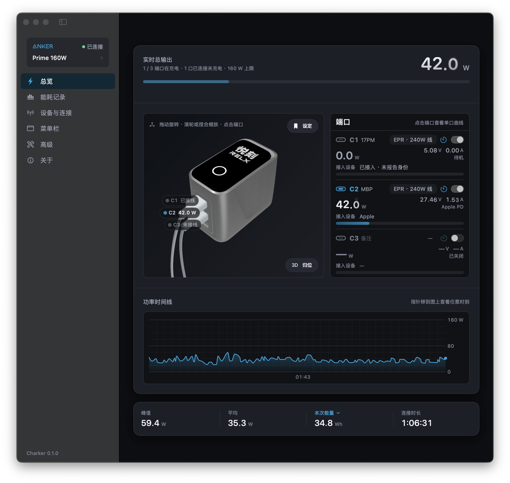

<div align="center">
  
  <h1>Charker</h1>
  <p><strong>Bring live power, energy history, and device controls for the Anker Prime 160W to your Mac.</strong></p>
  <p>A native, lightweight, local-first macOS companion.</p>
  <p><a href="README.md">简体中文</a> · English</p>
  <p>
    <a href="https://github.com/qzz0518/Charker/stargazers"></a>
    
    
    <a href="LICENSE"></a>
    <a href="https://x.com/zerah_eth"></a>
  </p>
</div>

<p align="center">
  
</p>

Charker is an unofficial macOS app for the **Anker Prime 160W (A2687)**. It establishes an encrypted
CoreBluetooth session directly with the charger and brings per-port telemetry, local energy history,
and practical controls into a native window and the menu bar. Charging data stays between your Mac
and the charger; it is never routed through a Charker server.

> [!IMPORTANT]
> Charker is an independent interoperability project. It is not affiliated with or endorsed by Anker.
> Hardware behavior has currently been verified on one A2687 running BLE firmware `v0.0.5.2`.

## Features

- **Live overview**: total power plus voltage, current, power, cable capability, and charging protocol
  for C1 / C2 / C3, shown through a native 3D digital twin, port cards, and a live timeline.
- **Menu bar monitoring**: keep total or per-port readings visible without leaving the main window open;
  combine icons, values, separators, and custom text.
- **Energy and cost**: inspect sessions, today, this week, this month, or all history, including energy,
  peak and average power, port composition, and load distribution. Configure a currency and electricity
  rate, clear the selected period, or export CSV / JSON.
- **Device and connection management**: first-run guidance, nearby devices, remembering and reconnecting.
  Scanning stops after a successful connection to avoid needless UI churn in busy Bluetooth environments.
- **Device controls**: port output and shutdown timers use confirmation, ACK handling, and state readback.
  Display language, brightness, auto-lock, orientation, and auto-rotation are hardware-verified on the
  tested firmware.
- **Screen personalization**: edit the digital twin display and experimentally transfer a custom image
  to the charger's physical screen.
- **Simulated charger**: explore live telemetry, port states, energy history, and controls without hardware.
  Simulated data is kept separate from real history.
- **Secure updates**: check for and install EdDSA-signed releases through Sparkle while keeping the installer
  inside the macOS sandbox and Developer ID trust chain.
- **Chinese and English**: the window, menu bar, status messages, permission copy, and diagnostics are localized.

## Quick Start

### Requirements

- macOS 14 or later
- An Apple Silicon Mac (hardware-verified); release builds are Universal 2, while real Bluetooth use on Intel remains unverified
- An Anker Prime 160W (A2687) for a real connection; the simulator works without one

> [!WARNING]
> `v0.1.0` is currently a temporary preview. It is Developer ID-signed, but its first Apple notarization
> is still in progress. macOS may block the first launch; wait for the final notarized build if you need
> complete Gatekeeper verification.

### Homebrew (Temporary Preview)

```bash
brew install --cask qzz0518/tap/charker
```

To update later:

```bash
brew upgrade --cask charker
```

### Install from DMG

Download `Charker-0.1.0-unnotarized.dmg` from
[Releases](https://github.com/qzz0518/Charker/releases), open it, and drag Charker into Applications.

Homebrew and Releases use the same Developer ID-signed Universal 2 preview DMG. Both channels will move
to the same final artifact once Apple notarization completes.

#### First Launch While Notarization Is Pending

1. Control-click Charker in Applications, choose **Open**, then confirm **Open** again; or use
   **System Settings → Privacy & Security → Open Anyway**. This is the preferred path because it preserves
   explicit macOS user consent.
2. Only if those options are unavailable, and only after downloading from this repository's Release and
   verifying the `.sha256` file, run:

   ```bash
   xattr -dr com.apple.quarantine "/Applications/Charker.app"
   ```

   This removes quarantine only from the Charker bundle. Do not add `sudo` or broaden the path to
   Applications or any other directory. The final notarized build will not require this step.

### Build from Source

Building from source requires Xcode Command Line Tools and Swift 6.0+:

```bash
git clone https://github.com/qzz0518/Charker.git
cd Charker
mise run verify
open dist/Charker.app
```

`mise run verify` builds every target, runs the tests, checks both localization tables, and assembles
the locally signed `dist/Charker.app`. Without mise, run:

```bash
swift test
CONFIG=release Scripts/make-app.sh
open dist/Charker.app
```

> [!NOTE]
> Test real Bluetooth through the signed `.app`. `swift run Charker` is useful for UI and simulator work,
> but it has no complete app bundle, Bluetooth usage description, or entitlement and is not a valid
> real-device test.

## First Connection

1. Power the charger and fully quit the official Anker app or any other client using it.
2. Open Charker, follow the empty-state guidance to **Devices & Connection**, and select the charger.
3. If the firmware requires the bound identity, use the one-time helper under **Anker Account ID** or
   enter your own `user_id` manually. Charker stores only that ID, never the password or login token.
4. If no charger is available, start **Simulated Charger** from the connection guide or Advanced settings.

The A2687 accepts only one client at a time and may stop advertising entirely while another client is
connected. A missing device often means the official app, another computer, or another Charker instance
still owns the connection.

## Verified Scope

| Capability | Status | Boundary |
| --- | --- | --- |
| Encrypted session and three-port telemetry | Hardware-verified | A2687 / BLE `v0.0.5.2` / macOS 15.7.7, roughly 1 Hz |
| Display language, brightness, lock, orientation, auto-rotation | Hardware-verified | Brightness is limited to 25%–100% |
| Port output and shutdown timer | Guarded flow implemented | Interrupts power immediately; verify behavior on your firmware |
| Custom display image transfer | Experimental | The charger has 4 slots and no delete command; each transfer occupies a slot until later transfers replace it |
| Simulated charger | Covered by automated tests | No Bluetooth connection and no writes to real energy history |

## Privacy and Network Use

| Data | How Charker handles it |
| --- | --- |
| Live charging telemetry | Read over local Bluetooth and decoded in memory |
| Energy history and preferences | Stored only in this Mac's app data |
| Anker account helper | Contacts Anker only when explicitly requested; the password is not persisted, the returned token is discarded, and only `user_id` is retained |
| Software updates | Sparkle periodically reads a signed appcast from GitHub Pages and downloads a user-approved release only from GitHub Releases |
| Diagnostic export | Masks serial numbers and Bluetooth addresses by default; raw packet logging is opt-in |
| Analytics and tracking | No Charker server, analytics SDK, or telemetry upload |

The GitHub and X buttons only open those pages in your default browser. Apart from software updates and
the optional account-ID helper, monitoring and controlling the charger needs no internet connection.

## Development

Charker uses SwiftPM. Common tasks are defined in [`mise.toml`](mise.toml):

| Command | Purpose |
| --- | --- |
| `mise run build` | Build every target |
| `mise run test` | Run protocol and session tests |
| `mise run i18n` | Validate Chinese and English keys and format placeholders |
| `mise run release-config` | Validate Sparkle, sandbox, and release metadata without reading secrets |
| `mise run bundle` | Assemble and ad-hoc sign the local app |
| `mise run bundle-universal` | Assemble and ad-hoc sign a Universal 2 app |
| `mise run release-dry-run` | Create an unnotarized Universal 2 candidate DMG with Developer ID |
| `mise run release` | Build from a clean tag, sign, notarize, staple, and generate the signed appcast |
| `mise run verify` | Build, test, validate localization/release config, and verify the host-architecture development app |

```text
Sources/
├── A2687Protocol/  Frames, TLV, cryptographic handshake, commands, and telemetry
├── CharkerCore/    CoreBluetooth, sessions, history, preferences, diagnostics, and simulation
├── CharkerApp/     SwiftUI / AppKit interface and menu bar
└── CharkerDraco/   Draco adapter for the 3D model
Tests/              Protocol, session, history, settings, and transfer tests
```

An ad-hoc build can appear as a new Bluetooth permission principal whenever the binary changes. To keep
a stable local development identity:

```bash
Scripts/make-signing-identity.sh
IDENTITY="Charker Dev" CONFIG=release Scripts/make-app.sh
```

This remains a development identity. Public distribution still requires Developer ID signing, Hardened
Runtime, notarization, and stapling.

### For Release Maintainers

Formal releases use the Developer ID identity, the `Charker-Notary` keychain profile, and Sparkle's EdDSA
private key. None of them are stored in this repository. `mise run release` requires a clean working tree
and a version-matching tag on `HEAD`. The pipeline notarizes and staples the App before sealing it into a
separately signed, notarized, and stapled DMG. That same final DMG is shared by GitHub Releases, Sparkle,
and the Homebrew Cask so every channel points to identical bytes.

## Contributing

Issues and pull requests are welcome. For protocol or hardware changes, include the model, BLE firmware,
reproduction steps, and redacted diagnostics. Never publish account IDs, full serial numbers, Bluetooth
addresses, keys, or private raw captures.

- [Report an issue](https://github.com/qzz0518/Charker/issues)
- [Browse the source](https://github.com/qzz0518/Charker)
- [Follow @zerah_eth on X](https://x.com/zerah_eth)

## Acknowledgements

Protocol facts and test vectors were informed by these public projects. Charker's Swift implementation
was written independently:

- [flip-dots/SolixBLE](https://github.com/flip-dots/SolixBLE)
- [Hyper-Beast/Anker_Prime_160W_WebBLE](https://github.com/Hyper-Beast/Anker_Prime_160W_WebBLE)
- [atc1441/Anker_Prime_BLE_hacking](https://github.com/atc1441/Anker_Prime_BLE_hacking)
- [thomluther/anker-solix-api](https://github.com/thomluther/anker-solix-api)

See [`THIRD-PARTY-NOTICES.md`](THIRD-PARTY-NOTICES.md) for exact sources, revisions, and licenses.

## License

Project-authored code is released under the [MIT License](LICENSE). Anker trademarks, product images,
3D models, and other third-party materials are not relicensed under MIT; their respective owners retain
their rights. See [`THIRD-PARTY-NOTICES.md`](THIRD-PARTY-NOTICES.md).
